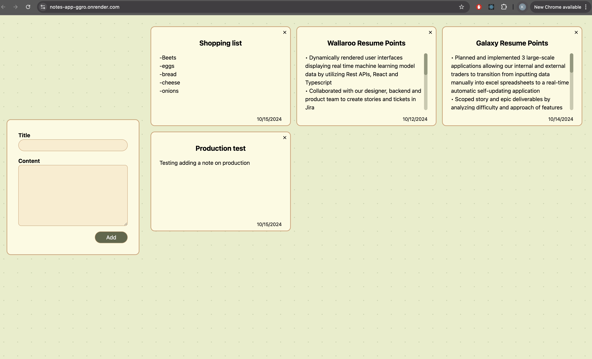

# Notes Application

A notes app project that's built with React, Typescript, NodeJS, Express and Vite. 

I'm using Render's free plan to host this site. A caveat with this is that Render's free instance will spin down with inactivity, which can delay requests by 50 seconds or more. When loading the site, it will initially be blank. Please allow at least 1-2 minutes for the instance to spin up. 

After the instance is up and the page loads, you should see the dashboard with some notes:

Here is the link to the site:
https://notes-app-ggro.onrender.com/

Thanks for checking out my project! 
